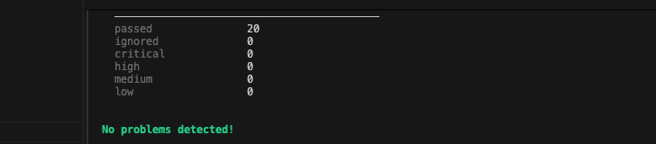
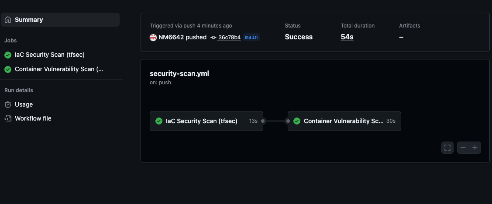

# DevSecOps Security Automation v2 (Continuation)

This repository is a **continuation of the previous DevSecOps Security Automation project**, expanding it with enhanced **security best practices**, **AWS S3 configuration hardening**, and **automated CI/CD scanning** through **GitHub Actions**.

---

##  What's New in v2

* Uses an **existing secure S3 bucket**  from the previous project.
* Added **KMS encryption with key rotation**.
* Configured **S3 access logging** to a dedicated log bucket.
* Integrated **GitHub Actions** for:

  * **tfsec** (Infrastructure as Code scanning)
  * **Trivy** (Container vulnerability scanning)
* Follows a **fail-fast security enforcement** model pipeline fails if high or critical vulnerabilities are detected.


---

## How the Pipeline Works

1. **Push code** → triggers GitHub Actions workflow.
2. **tfsec job** → scans Terraform IaC for misconfigurations.
3. **Trivy job** → builds Docker image and scans for vulnerabilities.
4. **Fail Policy** → pipeline stops if CRITICAL/HIGH issues are found.

---

## Infrastructure Overview

This Terraform configuration provisions and secures an **Amazon S3 bucket** with production-grade security controls:

* **Private S3 bucket** with `Block Public Access` enabled
* **Server-Side Encryption (SSE)** using **AWS KMS**
* **Bucket Versioning** for data recovery
* **HTTPS-only policy** to enforce encrypted data transfers
* **Access Logging** to a dedicated log bucket
* **KMS Key Rotation** for secure key management


---

## How We Overcame the Security Issues

During the initial phase, **tfsec** identified several misconfigurations in the S3 setup.
We remediated these findings and implemented AWS best practices to strengthen security:

1. **Removed public access**

   * Public ACLs and policies that exposed the bucket to the internet were removed.

2. **Enabled S3 Public Access Block**

   * Prevents the bucket from being made public again by mistake.

3. **Enabled default encryption**

   * All S3 objects are now encrypted using **Server-Side Encryption (SSE)** with AWS KMS.

4. **Enforced HTTPS-only data transfer**

   * Added a bucket policy to deny any unencrypted (`HTTP`) requests.

5. **Enabled versioning**

   * Protects against accidental or malicious file deletions or overwrites.

6. **Enabled access logging**

   * Configured S3 access logs to a dedicated logging bucket for audit and traceability.

7. **Verified fixes using tfsec scan**

   * After implementing these changes, **tfsec reported no remaining MEDIUM/HIGH/CRITICAL issues**.

---

##  Pipeline Flow

```text
Developer Push → GitHub Actions Trigger
         ↳ tfsec → IaC Scan → Report Security Findings
         ↳ trivy → Container Scan → Detect Image Vulnerabilities
         ↳ Secure, Tested Build Ready for Deployment
```
## Screenshots:

### tfsec Scan Results


### GitHub Actions Workflow



